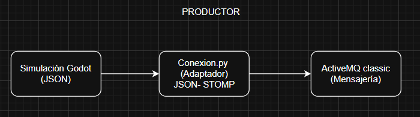
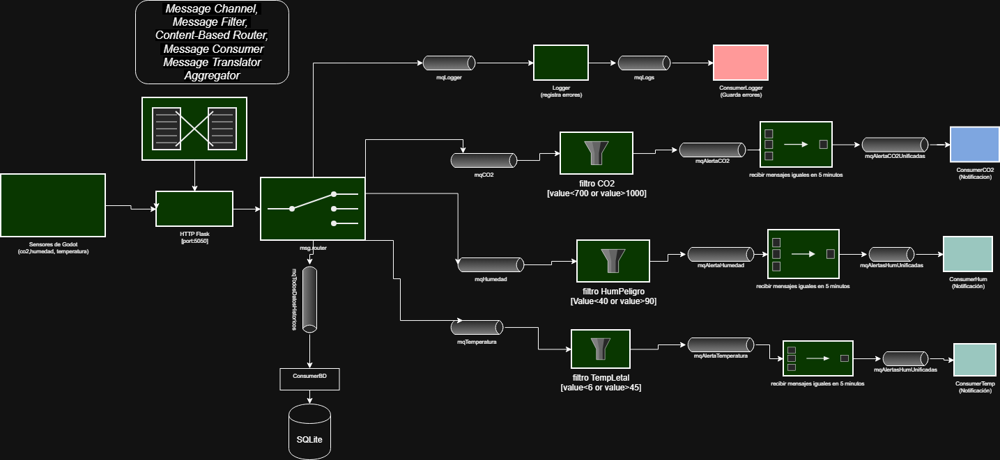
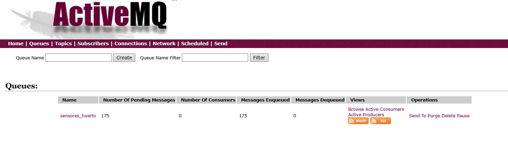
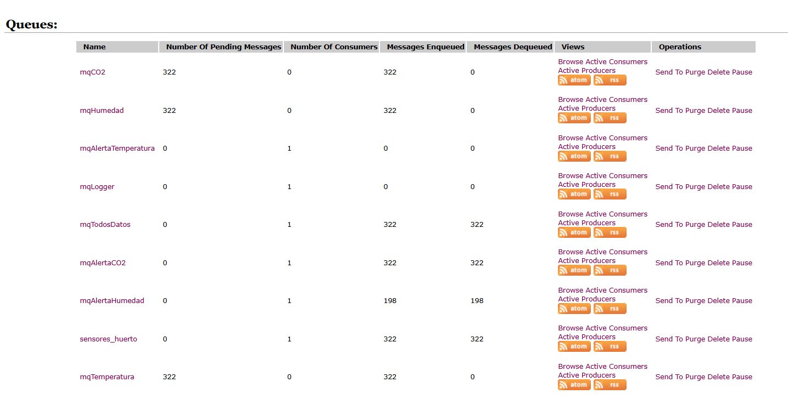

# PROCESO
Elegimos hacer el proceso de cultivo de tomates en un huerto, con sensor de CO2(ppm), Humedad(%) y Temperatura(°C).
# Propuesta de Integración 
## PRODUCTOR:
La simulación la hicimos en Godot, lo cual nos permitio hacerlo en 2D, pero es obvio que Godot no esta conectado directamente a algún broker o por lo menos es un proceso complejo el hacerlo directo, por lo que se siguio la siguiente logica:

* Godot por el servidor 127.0.0.1:5050 (el puerto puede cambiar si uno lo quiere) envía el JSON usando el metodo POST en HTTPRequest, así mandamos el json
que tiene la siguiente estructura "{"co2":120,"humedad":124,"temperatura":18.7018909454346}" al URL local y de ese podremos usarlo para 
pasarlo a nuestro broker elegido (ActiveMQ classic), porque como se menciona, Godot no habla de manera nativa con ActiveMQ.

* Desde nuestro script adaptador conexion.py nos conectamos al mismo servidor HTTP que Godot para obtener los JSON, y igualmente nos conectamos a ActiveMQ classic, que esta en http://127.0.0.1:8161/ y el usuario y contraseña son "admin". Así podremos ponerlos en la cola principal usando STOMP.

* ActiveMQ distribuira el mensaje a quien corresponda (a consumidores).



## Diagrama EIP
Nuestro diagrama EIP es el siguiente:



Los sensores de Godot, mandan el JSON al adaptador que debe pasarlos a STOMP que es el protocolo de ActiveMQ. 
De la cola principal se usa un Content-Based Router para separar el JSON unico en colas especializadas(mqCO2, mqHumedad, etc). Para tener una copia de todos los datos, tenemos la cola mqTodoDatosHistoricos que ira a la Base de datos (SQLite).

Los Message Filter lo usamos para descartar datos normales y dejar pasar solo las anomalías que requieran tener alertas. Como no queremos que los consumidores sufran de spam, se usa un Aggregator agrupando alertas repetidas en un período de tiempo.

Al final tenemos 5 consumers: ConsumerCO2, ConsumerHumedad, ConsumerTemperatura, ConsumerBD(Datos historicos), ConsumerLogger(para los errores).

## Implementación (Arquitectura):
En total nuestra arquitectura es de 4 componentes:
 * 1) Simuladoción (Godot): Genera datos y los envia como JSON.
 * 2) Adaptador (conexion.py):Recibe HTTP de Godot y lo traduce a mensajes STOMP.
 * 3) Router(router.py): Consumidor STOMP que implementa lo de Content-Based Router y Message Filter vistos en el diagrama.
 * 4) Consumidores (consumidores.py): Son los consumidores finales que se conectan a las colas correspondientes.

## Desafíos:
Aprender como simular algo, debido a que no solemos tener experiencia en IoT, y como lo dice al hacer una integración, se usan distintas cosas, y conectarlas de buena manera toma tiempo, debemos entender que estamos haciendo para no perdernos.
## Capturas extra:
Cola principal:




Colas según dato:



## ¿Cómo ejecutarlo?

### Requisitos previos:
1. Tener ActiveMQ Classic instalado y corriendo (http://127.0.0.1:8161/)
2. Python 3.8 o superior
3. Godot 4.x

### Pasos:

1. **Instalar dependencias de Python:**
```bash
   pip install -r requirements.txt
```

2. **Terminal 1 - Iniciar el adaptador HTTP:**
```bash
   python productor.py
```
3. **Terminal 4 - Ejecutar la simulación:**
   - Abrir el proyecto en Godot y ejecutarlo
   - Usar la barra espaciadora para generar variaciones en humedad y CO2

4.**Terminal 2 - Iniciar el router:**
```bash
   python router.py
```

5. **Terminal 3 - Iniciar los consumidores:**
```bash
   python consumidores.py
```

### Verificar que funciona:
- Abrir la consola web de ActiveMQ: http://127.0.0.1:8161/admin
- Usuario: `admin`, Contraseña: `admin`
- Ver las colas llenándose en tiempo real


